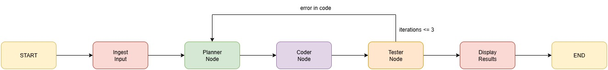

# ai-agent-challenge
Coding agent challenge which write custom parsers for Bank statement PDF.

## Getting Started

Follow these steps to set up and run the project.

### 1. Clone the repository
```bash
git clone github.com/apurv-korefi/ai-agent-challenge
```

### 2. Install dependencies
```bash
pip install -r requirements.txt
```

### 3. Run the agent
```bash
python agent.py --target icici
```

### 4.  Run the tests
```bash
pytest
```

## Architecture Diagram



## Explanation

Input Node (Ingest PDF)

Reads and parses the input PDF document.

Extracts text/content that will be passed into the workflow.

Planner Node

Analyzes the ingested content and creates a plan.

Generates candidate code (e.g., SQL query, script, or function) based on the extracted instructions.

Coder Node (Execution Check)

Takes the code from the Planner.

Executes the code safely.

Collects execution results (intermediate outputs).

Tester Node (CSV Validation)

Compares the actual output CSV (from Coder execution) against the expected CSV.

If mismatch/error → feedback is sent back to Planner for re-planning.

This loop continues up to 3 times max.

Output Node (Display Results)

Once Tester approves (CSV matches), the final results are displayed on terminal.

END

Workflow stops after success or after 3 failed iterations.